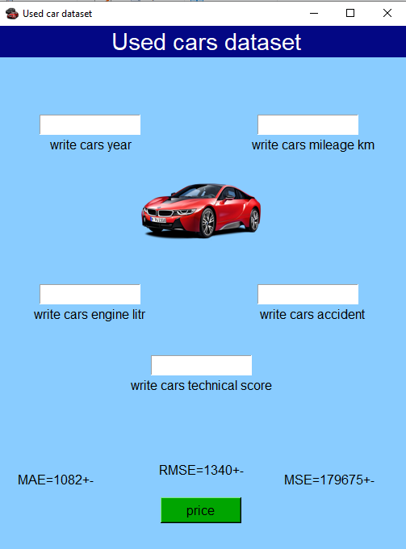

# 🚗 Used Car Price Prediction with AI



## 📌 Project Overview
This project is a **Machine Learning** model based on **Regression** techniques, designed to predict the price of used cars. The model estimates the price automatically based on the technical features and history of the vehicle.

## 🎯 Project Goal
The main goal of this project is to build an accurate and reliable model that can predict the **estimated price of a used car** based on its technical specifications. This can be highly useful for buyers, sellers, and car trading platforms.

## 📂 Dataset
- **File name:** `used_car_price_dataset.xlsx`
- **Format:** Excel (.xlsx)

## 🧩 Features
The model uses the following columns as input features:

| Column Name         | Description                              |
|----------------------|-------------------------------------------|
| `Year`               | Manufacturing year of the car             |
| `Mileage_Km`         | Mileage of the car in kilometers          |
| `Engine_L`           | Engine displacement in liters             |
| `Accident_Count`     | Number of recorded accidents              |
| `Technical_Score`    | Technical condition score of the car      |

**Target variable (Output):** Car price

## 🧠 Machine Learning Approach
This project uses a **Supervised Regression** model. The entire implementation was done using the **Python** programming language and the **scikit-learn (sklearn)** library.

## 📊 Model Evaluation
Three common regression metrics were used to evaluate the model's performance. Below is the formula and explanation for each one:

### 1️⃣ MAE (Mean Absolute Error)
The average of the absolute errors; it shows, on average, how far the model's predictions are from the actual values (regardless of error direction).

```
MAE = (1/n) * Σ |yᵢ - ŷᵢ|
```

**Result obtained in this project:** `MAE = 1080`

### 2️⃣ MSE (Mean Squared Error)
The average of the squared errors; it penalizes larger errors more heavily, since the differences are squared.

```
MSE = (1/n) * Σ (yᵢ - ŷᵢ)²
```

**Result obtained in this project:** `MSE = 179675`

### 3️⃣ RMSE (Root Mean Squared Error)
The square root of the MSE; its unit matches the target variable (price), which makes it easier to interpret than MSE.

```
RMSE = √MSE = √[(1/n) * Σ (yᵢ - ŷᵢ)²]
```

**Result obtained in this project:** `RMSE = 1340`

> 💡 In general, lower values for these three metrics indicate higher model accuracy.

## 🛠️ Technologies Used
- Python
- scikit-learn (sklearn)
- pandas
- NumPy
- Matplotlib / Seaborn (if used for visualizations)

## 🗂️ Project Structure
```
used-car-price-prediction/
│
├── data/
│   └── used_car_price_dataset.xlsx
│
├── images/
│   └── Image_AI.png
│
├── notebooks/
│   └── model_training.ipynb
│
├── src/
│   ├── preprocessing.py
│   ├── train_model.py
│   └── evaluate_model.py
│
├── README.md
└── requirements.txt
```

## 🚀 How to Run
1. Clone the repository:
   ```bash
   git clone https://github.com/your-username/used-car-price-prediction.git
   cd used-car-price-prediction
   ```
2. Install the required dependencies:
   ```bash
   pip install -r requirements.txt
   ```
3. Place the dataset file (`used_car_price_dataset.xlsx`) inside the `data/` folder.
4. Run the model training script:
   ```bash
   python src/train_model.py
   ```
5. Run the model evaluation script:
   ```bash
   python src/evaluate_model.py
   ```

## 🔄 Project Workflow
1. Load and perform an initial inspection of the dataset.
2. Clean and preprocess the data.
3. Split the data into training and testing sets.
4. Train a regression model using scikit-learn.
5. Evaluate the model using MAE, MSE, and RMSE.
6. Analyze the results and identify areas for improvement.

## ✅ Conclusion
The developed model is able to predict used car prices with acceptable accuracy, based on the technical features and history of the vehicle. The obtained MAE, MSE, and RMSE values indicate that the model performs reasonably well in price estimation, although there is still room for improvement.

## 🔮 Future Improvements
- Increase the size and diversity of the training data.
- Add new features such as brand, fuel type, and transmission.
- Experiment with more advanced models such as Random Forest, XGBoost, and Gradient Boosting.
- Perform hyperparameter tuning using GridSearchCV or RandomizedSearchCV.
- Use Cross-Validation for more robust model evaluation.
- Design a web application or API for practical use of the model.
